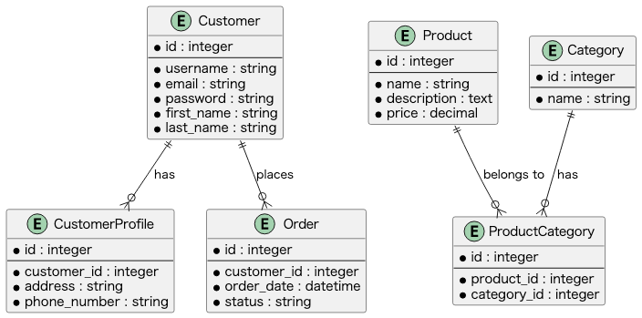
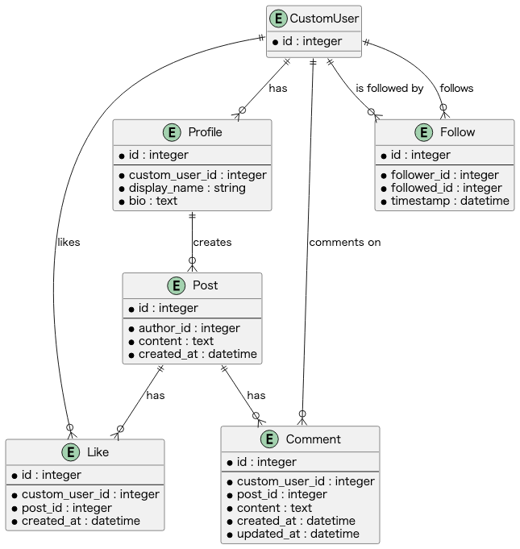

### ChatGPT(Plus)に Python - Django - DRF(Django RestFramework)のアプリ、API作成させる。
### との試みで３つのアプリ、APIを作成（作成中もあり）しました。
### ChatGPT(PLUS)で、ドキュメントも作成しました。

### 作成したアプリは
1. ToDoアプリ
2. ECアプリ（API)
3. SNSアプリ（API)

#### ER図は各アプリケーションのmodels.pyはChatGPTに書かせました。

`python manage.py graph_models -a -g -o er.png`(これは全体像)

### Todoアプリ：

### ECアプリ

### SNSアプリ

### 全体

api-token-auth

| HTTP Method | Input                            | Processing                | Output                             | Functionality                                |
|-------------|----------------------------------|---------------------------|------------------------------------|----------------------------------------------|
| POST        | `username`, `password` (JSON)    | Validate user credentials | `token` (JSON) on success          | Log in and obtain authentication token       |

## login, logout - IPO 
| APIエンドポイント   | 機能       | HTTPメソッド | 入力                                  | 処理                             | 出力                           | 認証が必要か |
|--------------|----------|-----------|-----------------------------------|--------------------------------|-----------------------------|---------|
| /api/login/  | ログイン     | POST      | - ユーザー名                         | - ユーザー名とパスワードを照合し、      | - 認証トークン                   | No      |
|              |          |           | - パスワード                         |   正しい場合は認証トークンを発行      |                             |         |
| /api/logout/ | ログアウト   | POST      | - 認証トークン                       | - 認証トークンを無効化し、        | - ステータスコード204 (No Content) | Yes     |

## token
| API エンドポイント      | HTTP メソッド | 機能                     |
|--------------------|------------|------------------------|
| /api/token/        | POST        | トークンベースの認証               | いいえ      |
| /api/token/refresh/ | POST        | アクセストークンの更新             | はい        |
| /api/token/revoke/ | POST        | アクセストークンの無効化           | はい        |

### token-IPO

| APIエンドポイント      | 機能                  | HTTPメソッド | 入力                | 処理                            | 出力                           | 認証が必要か |
|----------------------|---------------------|-----------|-------------------|------------------------------|-----------------------------|---------|
| /api/token/          | トークン取得            | POST      | - ユーザー名         | - ユーザー名とパスワードを検証        | - アクセストークンとリフレッシュトークン | No      |
|                     |                     |           | - パスワード         | - アクセストークンとリフレッシュトークン生成 |                           |         |
| /api/token/refresh/ | トークンの更新          | POST      | - リフレッシュトークン  | - リフレッシュトークンを検証          | - 新しいアクセストークン            | No      |
| /api/token/revoke/  | トークンの無効化         | POST      | - アクセストークン    | - アクセストークンを無効化            | - ステータスコード204 (No Content)   | Yes     |

## custom_user
| API エンドポイント | HTTP メソッド | 機能                          | 認証が必要 |
|-------------|-------------|-----------------------------|-----------|
| /api/custom_users/ | POST        | 新規ユーザー登録                  | いいえ      |
| /api/custom_users/ | GET         | ユーザー一覧の取得                | はい        |
| /api/custom_users/{id}/ | GET      | 指定ユーザーの取得                | はい        |
| /api/custom_users/{id}/ | PUT      | 指定ユーザーの更新                | はい        |
| /api/custom_users/{id}/ | DELETE   | 指定ユーザーの削除                | はい        |

### custom_user-IPO

| APIエンドポイント         | 機能                  | HTTPメソッド | 入力                                    | 処理                                  | 出力                                      | 認証が必要か |
|-------------------------|---------------------|-----------|-------------------------------------|------------------------------------|---------------------------------------|---------|
| /api/custom_users/      | ユーザー一覧取得          | GET       | なし                                  | - ユーザー一覧を取得                    | - ユーザー一覧                             | Yes     |
| /api/custom_users/      | ユーザー登録            | POST      | - ユーザー名                           | - ユーザー情報を登録                    | - 登録されたユーザー情報                       | No      |
|                         |                     |           | - パスワード                           |                                      |                                       |         |
|                         |                     |           | - メールアドレス                       |                                      |                                       |         |
| /api/custom_users/{id}/ | ユーザー詳細取得          | GET       | - ユーザーID                           | - 指定されたIDのユーザー情報を取得          | - 指定されたIDのユーザー情報                   | Yes     |
| /api/custom_users/{id}/ | ユーザー情報更新          | PUT       | - ユーザーID                           | - 指定されたIDのユーザー情報を更新          | - 更新されたユーザー情報                       | Yes     |
|                         |                     |           | - ユーザー名 (オプション)               |                                      |                                       |         |
|                         |                     |           | - パスワード (オプション)               |                                      |                                       |         |
|                         |                     |           | - メールアドレス (オプション)           |                                      |                                       |         |
| /api/custom_users/{id}/ | ユーザー情報削除          | DELETE    | - ユーザーID                           | - 指定されたIDのユーザー情報を削除          | - ステータスコード204 (No Content)            | Yes     |

## Tasks
| Resource | Method | Endpoint                       | Description                                |
|-----------|--------|-------------------------------|-------------------------------------------|
| Task     | GET    | /api/tasks/                    | Get the list of tasks                      |
| Task     | POST   | /api/tasks/                    | Create a new task                          |
| Task     | GET    | /api/tasks/<task_id>/          | Get the details of a specific task         |
| Task     | PUT    | /api/tasks/<task_id>/          | Update a specific task                     |
| Task     | PATCH  | /api/tasks/<task_id>/          | Partially update a specific task           |
| Task     | DELETE | /api/tasks/<task_id>/          | Delete a specific task                     |

## Category
| Resource | Method | Endpoint                       | Description                                |
|-----------|--------|-------------------------------|-------------------------------------------|
| Category | GET    | /api/categories/               | Get the list of categories                 |
| Category | POST   | /api/categories/               | Create a new category                      |
| Category | GET    | /api/categories/<category_id>/ | Get the details of a specific category     |
| Category | PUT    | /api/categories/<category_id>/ | Update a specific category                 |
| Category | PATCH  | /api/categories/<category_id>/ | Partially update a specific category       |
| Category | DELETE | /api/categories/<category_id>/ | Delete a specific category                 |

### Category-IPO 

## Myself
| Resource | Method | Endpoint                       | Description                                |
|-----------|--------|-------------------------------|-------------------------------------------|
| Myself   | GET    | /api/myself/                   | Get your own user information              |
| Myself   | PUT    | /api/myself/                   | Update your own user information           |
| Myself   | PATCH  | /api/myself/                   | Partially update your own user information |

## Profile
| Resource | Method | Endpoint                       | Description                                |
|-----------|--------|-------------------------------|-------------------------------------------|
| Profile   | GET    | /api/profiles/               | Get the list of profiles                  |
| Profile   | POST   | /api/profiles/               | Create a new profile                      |
| Profile   | GET    | /api/profiles/<profile_id>/  | Get the details of a specific profile     |
| Profile   | PUT    | /api/profiles/<profile_id>/  | Update a specific profile                 |
| Profile   | DELETE | /api/profiles/<profile_id>/  | Delete a specific profile                 |

### Profile-IPO

| API エンドポイント | HTTP メソッド | 機能                          | 認証が必要 |
|-------------|-------------|-----------------------------|-----------|
| /api/profiles/{id}/ | GET         | 指定プロフィールの取得             | はい        |
| /api/profiles/{id}/ | PUT         | 指定プロフィールの更新             | はい        |
| /api/profiles/{id}/ | DELETE      | 指定プロフィールの削除             | はい        |

## Post
| Resource | Method | Endpoint                       | Description                                |
|-----------|--------|-------------------------------|-------------------------------------------|
| Post      | GET    | /api/posts/                  | Get the list of posts                     |
| Post      | POST   | /api/posts/                  | Create a new post                         |
| Post      | GET    | /api/posts/<post_id>/        | Get the details of a specific post        |
| Post      | PUT    | /api/posts/<post_id>/        | Update a specific post                    |
| Post      | DELETE | /api/posts/<post_id>/        | Delete a specific post                    |

### Post-IPO 

| API エンドポイント | HTTP メソッド | 機能                          | 認証が必要 |
|-------------|-------------|-----------------------------|-----------|
| /api/posts/ | POST        | 新規投稿の作成                   | はい        |
| /api/posts/ | GET         | 投稿一覧の取得                   | はい        |
| /api/posts/{id}/ | GET         | 指定投稿の取得                   | はい        |
| /api/posts/{id}/ | PUT         | 指定投稿の更新                   | はい        |
| /api/posts/{id}/ | DELETE      | 指定投稿の削除                   | はい        |

## Like
| Resource | Method | Endpoint                       | Description                                |
|-----------|--------|-------------------------------|-------------------------------------------|
| Like      | GET    | /api/likes/                  | Get the list of likes                     |
| Like      | POST   | /api/likes/                  | Create a new like                         |
| Like      | GET    | /api/likes/<like_id>/        | Get the details of a specific like        |
| Like      | PUT    | /api/likes/<like_id>/        | Update a specific like                    |
| Like      | DELETE | /api/likes/<like_id>/        | Delete a specific like                    |

### Like-IPO 

| API エンドポイント | HTTP メソッド | 機能                          | 認証が必要 |
|-------------|-------------|-----------------------------|-----------|
| /api/likes/ | POST        | 新規いいねの作成                 | はい        |
| /api/likes/ | GET         | いいね一覧の取得                 | はい        |
| /api/likes/{id}/ | DELETE      | 指定いいねの削除                 | はい        |

## Followe
| Resource | Method | Endpoint                       | Description                                |
|-----------|--------|-------------------------------|-------------------------------------------|
| Follow    | GET    | /api/follows/                | Get the list of follows                   |
| Follow    | POST   | /api/follows/                | Create a new follow                       |
| Follow    | GET    | /api/follows/<follow_id>/    | Get the details of a specific follow      |
| Follow    | PUT    | /api/follows/<follow_id>/    | Update a specific follow                  |
| Follow    | DELETE | /api/follows/<follow_id>/    | Delete a specific follow                  |

### Follows-IPO 

| API エンドポイント | HTTP メソッド | 機能                          | 認証が必要 |
|-------------|-------------|-----------------------------|-----------|
| /api/follows/ | POST        | 新規フォローの作成                | はい        |
| /api/follows/ | GET         | フォロー一覧の取得                | はい        |
| /api/follows/{id}/ | DELETE      | 指定フォローの削除                | はい        |

## Comments

### Comments-IPO 

| API エンドポイント | HTTP メソッド | 機能                          | 認証が必要 |
|-------------|-------------|-----------------------------|-----------|
| /api/comments/ | POST        | 新規コメントの作成                | はい        |
| /api/comments/ | GET         | コメント一覧の取得                | はい        |
| /api/comments/{id}/ | GET         | 指定コメントの取得                | はい        |
| /api/comments/{id}/ | PUT         | 指定コメントの更新                | はい        |
| /api/comments/{id}/ | DELETE      | 指定コメントの削除                | はい        |
